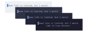

# vital-type



Terminal quote typing trainer. Records words per minute and accuracy. Theme and pacing are configurable.

**Requirements:** Python 3 and a terminal. Linux or macOS recommended.

---

## Install

Place the application in a directory of your choice and add the launcher to PATH.

### 1. Get the files

**Option A: git clone (recommended)**

```bash
# Download the project into ~/.local/share/vital-typing
git clone https://github.com/OwenW24/vital-typing.git ~/.local/share/vital-typing
```

**Option B: copy manually**

Place the project folder at any path, for example `~/.local/share/vital-typing/`, containing at least:

```
vital-typing/
  race.py
  bin/vital-type
```

### 2. Add vital-type to PATH

```bash
# Allow the launcher script to be executed
chmod +x ~/.local/share/vital-typing/bin/vital-type

# Create ~/.local/bin if it does not exist
mkdir -p ~/.local/bin

# Link vital-type into ~/.local/bin so the shell can find it by name
ln -sf ~/.local/share/vital-typing/bin/vital-type ~/.local/bin/vital-type
```

If `~/.local/bin` is not on PATH, add the following to `~/.bashrc` or `~/.zshrc`:

```bash
# Prepend ~/.local/bin so commands like vital-type are found before system paths
export PATH="$HOME/.local/bin:$PATH"
```

Open a new terminal, or reload the shell configuration:

```bash
# Apply PATH changes in the current terminal without reopening it
source ~/.zshrc
```

### 3. Run from any directory

```bash
# Launch the typing trainer
vital-type
```

On first run, the program creates a `data/` directory beside `race.py` for settings and statistics.

---

## Quick run (without installing)

From the project directory:

```bash
# Run the application with Python; PATH setup is not required
python3 race.py
```

---

## Home menu

| Key | Action |
|-----|--------|
| Tab, Up, Down | Move selection |
| Enter | Select |
| Esc | Quit |

- **race**: start typing
- **quotes**: switch quote list (Nietzsche, Mishima)
- **style**: theme, pacer, caret markers
- **settings**: restore defaults, reset statistics
- **stats**: view summary; Enter cycles daily, weekly, monthly, all

---

## During a race

| Key | Action |
|-----|--------|
| Type | Enter the quote |
| Tab | New random quote (same list) |
| Backspace | Delete character or overflow |
| Esc | Return to home |
| Ctrl+C | Quit |

- Correct characters appear in green. Incorrect characters show the expected letter in red.
- Characters typed beyond the target before a space appear in magenta.
- The pacer, if enabled under **style**, marks expected progress through the quote.

---

## Style settings

- **theme**: Catppuccin variants (latte, frappe, macchiato, mocha)
- **pacer**: on or off
- **pacer wpm**: target speed when the pacer is enabled
- **pacer marker**, **caret marker**: underline, block, bright, dim

---

## Data

| Path | Purpose |
|------|---------|
| `data/config.json` | Preferences (theme, pacer, list selection) |
| `data/stats.json` | Race history |
| `data/words.json` | Quote lists (refreshed from the application on each run) |

Quote text is defined in `race.py`. To change quotes, edit `DEFAULT_QUOTES` in that file.

**Settings, danger zone**

- *Restore account to default*: resets preferences
- *Reset stats*: clears race history

---

## Uninstall

```bash
# Remove the vital-type command from PATH
rm ~/.local/bin/vital-type

# Remove the application directory, including settings and statistics in data/
rm -rf ~/.local/share/vital-typing
```

Remove the PATH entry from the shell configuration if it was added only for this application.
